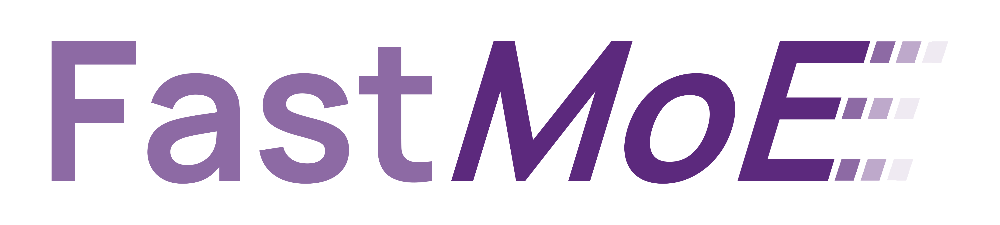

[Release note](doc/release-note.md)
| [中文文档](doc/readme-cn.md)
| [Slack workspace](https://join.slack.com/t/fastmoe/shared_invite/zt-mz0ai6ol-ggov75D62YsgHfzShw8KYw)

## Introduction

An easy-to-use and efficient system to support the Mixture of Experts (MoE) 
model for PyTorch. 

## Installation

### Prerequisites

PyTorch with CUDA is required. The repository is currently tested with PyTorch
v1.8.0 and CUDA 10, with designed compatibility to older versions.

If the distributed expert feature is enabled, NCCL with P2P communication
support, typically versions `>=2.7.5`, is needed. 

### Installing

FastMoE contains a set of PyTorch customized opearators, including both C and
Python components. Use `python setup.py install` to easily install and enjoy
using FastMoE for training.

The distributed expert feature is disabled by default. If you want to enable
it, pass environment variable `USE_NCCL=1` to the setup script.

Note that an extra NCCL developer package is needed, which has to be consistent
with your PyTorch's NCCL version, which can be inspected by running
`torch.cuda.nccl.version()`. The 
[official PyTorch docker image](https://hub.docker.com/r/pytorch/pytorch) is
recommended, as the environment is well-setup there. Otherwise, you can access
the [download link of all NCCL
versions](https://developer.nvidia.com/nccl/nccl-legacy-downloads) to download
the NCCL package that is suitable for you.

## Usage 

### FMoEfy a Transformer model

Transformer is currently one of the most popular models to be extended by MoE. Using
FastMoE, a Transformer-based model can be extended as MoE by an one-key plugin
shown as follow.

For example, when using [Megatron-LM](https://github.com/nvidia/megatron-lm),
using the following lines can help you easily scale up the MLP layers to
multiple experts.

```python
model = ...

from fmoe.megatron import fmoefy
model = fmoefy(model, num_experts=<number of experts per worker>)

train(model, ...)
```

A detailed tutorial to _moefy_ Megatron-LM can be found
[here](examples/megatron).

### Using FastMoE as a PyTorch module

An example MoE transformer model can be seen in the
[Transformer-XL](examples/transformer-xl) example. The easist way is to replace
the MLP layer by the `FMoE` layers.

### Using FastMoE in Parallel

FastMoE supports both data parallel and model parallel. 

#### Data Parallel

In FastMoE's data parallel mode, both the gate and the experts are replicated on each worker. 
The following figure shows the forward pass of a 3-expert MoE with 2-way data parallel.

<p align="center">

</p>

For data parallel, no extra coding is needed. FastMoE works seamlessly with PyTorch's `DataParallel` or `DistributedDataParallel`.
The only drawback of data parallel is that the number of experts is constrained by each worker's memory.

#### Model Parallel

In FastMoE's model parallel mode, the gate network is still replicated on each worker but
experts are placed separately across workers.
Thus, by introducing additional communication cost, FastMoE enjoys a large expert pool whose size is proportional to the number of workers.

The following figure shows the forward pass of a 6-expert MoE with 2-way model parallel. Note that experts 1-3 are located in worker 1 while experts 4-6 are located in worker 2.

<p align="center">

</p>

FastMoE's model parallel requires sophiscated parallel strategies that neither PyTorch nor
Megatron-LM provides. The `fmoe.DistributedGroupedDataParallel` module is
introduced to replace PyTorch's DDP module.

## Citation

```
@article{he2021fastmoe,
      title={FastMoE: A Fast Mixture-of-Expert Training System}, 
      author={Jiaao He and Jiezhong Qiu and Aohan Zeng and Zhilin Yang and Jidong Zhai and Jie Tang},
      journal={arXiv preprint arXiv:2103.13262},
      year={2021}
}
```

## Troubleshootings / Discussion

If you have any problem using FastMoE, or you are interested in getting involved in developing FastMoE, feel free to join the [our slack channel](https://join.slack.com/t/fastmoe/shared_invite/zt-mz0ai6ol-ggov75D62YsgHfzShw8KYw).
