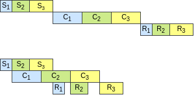

Boost the Performance by FasterMoE 
===

一个中文版见[这篇博客](https://laekov.com.cn/view/181401#howto)

There are three main optimizations in the PPoPP'22 paper _FasterMoE: Modeling
and Optimizing Training of Large-scale Dynamic Pre-trained Models_. Thanks to
the contributions of authors of the article, their optimizations are now
integrated into FastMoE, and can be enabled via switches of environment
variables. These optimizations can greatly increase the training efficiency of
FastMoE.

## Smart Scheduling

Recall that in an MoE layer, two `all-to-all`s are performed with the experts'
computation in-between. In FasterMoE, the `all-to-all`s are broken down using
a _group-wise exchange_ algorithm. And then, the expert can instantly start
its jobs as long as a part of input, e.g. tokens from one other worker, is
ready.

Its effectiveness is revealed in the following timeline. `S` and `R` stand for
the components of the `all-to-all`s, and `C` stands for computation of the
expert.

In FastMoE, to enable smart scheduling, set the environment variable `
FMOE_FASTER_SCHEDULE_ENABLE` to `1` or `ON`, and it is now by default off.

Please note that there are a few constraints for smart scheduling in the
current version of FastMoE. The input and output features have to be of
the same length for the experts. This is because the developers of FasterMoE
only implement this on their prototype, and they are looking for the
community's efforts to have other cases supported.

To fine-tune the performance of smart scheduling, the environment variable
`FMOE_FASTER_GROUP_SIZE` stands for the size of worker groups in the
_Group-wise Exchange_ algorithm. In other words, it is the granularity of the
schedule. It should be set to a proper value that balance between pipeline
bubbles and inefficient undersized computation granularity.

## Expert Shadowing

According to observations when training real models, when no limitation is
placed over expert selection, it follows a skew distribution, which means a few
experts are much more popular than others. This introduces significant
performance issue of load imbalance when using FastMoE's model parallel mode.

The authors of FasterMoE proposes the solution that for the hot experts, their
parameters are broadcast to all workers, namely shadows. With the shadows,
computation of the hot experts can be performed locally on all workers,
avoiding the bottleneck of sending so much workload to the workers containing
the hot experts. Besides, a performance predictor, together with a shadow
selection algorithm, is used to determine which experts to be shadowed before
each iteration.

In FastMoE, this feature is enabled by the environment variable
`FMOE_FASTER_SHADOW_ENABLE`.  For simplicity, this feature is only available
when smart scheduling is enabled. Besides the constraints of smart scheduling,
this feature requires the experts to be identical in structure, so that
parameters can be copied between experts.

A default shadow selection policy is located at
`fmoe/fastermoe/shadow_policy.py`. If you want to alter the policy, please code
there and re-install FastMoE. For the default policy, we assume that the
experts are two-layer MLPs. A few parameters of the policy can be specified by
the following environment variables for better effectiveness of the shadowing
mechanism.

* `FMOE_FASTER_GLBPLC_NETBW` is the bandwidth of the interconnection between
  workers, measured by `GBps`.
* `FMOE_FASTER_GLBPLC_GPUTP` is the GeMM throughput of the GPUs, measured by
  `FLOPs`, e.g. `13e12` for NVIDIA V100 PCIe GPUs using fp32.
* `FMOE_FASTER_GLBPLC_ALPHA` is the fraction of the activation length in the
  middle of the MLP to the input and output feature length, commonly seen to be
`2` or `4` in transformers.
* `FMOE_FASTER_GLBPLC_DMODEL` is the feature length of input and output of the
  experts. This parameter can be set automatically by FastMoE.

## Topology-aware Gate

The two optimizations above do not change the behavior of the model, while this
one does. To reduce network congestion when training in distributed system
with hierarchical network topology, e.g. many GPUs in each of many nodes, the
number of samples transmitted through the slower upper-level network is
limited. The overfilling tokens select experts within the same lower-level
network to reduce the communication overhead.

The example topology-aware gate is implemented as `FasterGate` among FastMoE's
gates. However, note that it may influence the accuracy of the model. And for
different training hardware, different topology-aware gates shall be designed
according to the specific case.

The environment variable `FMOE_TOPO_GPUS_PER_NODE` represents number of GPUs in
each local network, e.g. each node. And `FMOE_TOPO_OUTGOING_FRACTION` controls
the fraction of tokens that are allowed to be sent across the upper-level
network.
