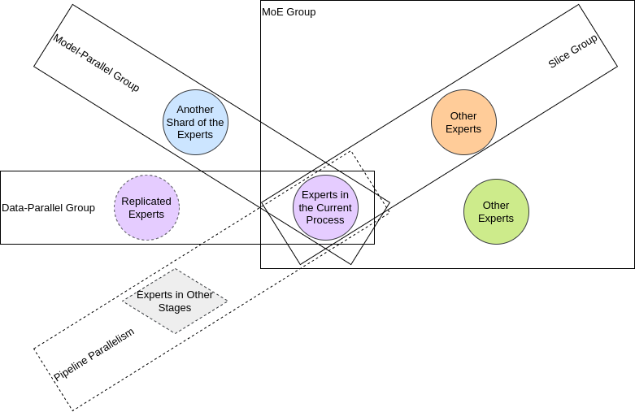

Multi-Dimensional Parallelism Supported by FastMoE
===

_这篇文档懒得写中文版了. 在获得来自社区的贡献前, 请自行谷歌翻译._

FastMoE now supports almost every popular way to train models in parallel, and any combination of them.
Below shows all possible group of processes that a process may get involved.
Users can enable them by simply assigning communication groups in either FastMoE or external codebase that uses FastMoE.

#### Data Parallel

In a group of data-parallel processes, models, including the experts, are replicated across the processes.
To have experts replicated, first, assign `expert_dp_comm="dp"` at `mark_parallel_comm` function of an `FMoE` instance.
(The string `"dp"` can be replaced by another name if you wish).
Then, wrap the MoE module with `fmoe.distributed.DistributedGroupedDataParallel`, 
and set `dp_group` in the constructor to the process group in PyTorch that you wish to perform data parallelism.
By default, the parameters are initially synchronized, unless disabled by `need_sync=False`.
Run `model.allreduce_params` every iteration after backward propagation.

#### Model Parallel

In typical model parallelism (maybe called tensor-model parallelism), every single expert is split up.
FastMoE requires the external codebase to implement it by properly splitting the expert module that is provided to FastMoE.
An official example using Megatron-LM can be seen in our adapter.
The `hidden_hidden_size` of FastMoE's transformer module is divided by `k` which denotes the number of model-parallel processes.
In this way, each expert is split into `k` pieces.
Then, an `all-reduce` is performed over the feature matrix externally in the adapter, so that output of the experts is merged.

#### Expert Parallel (MoE Group and Slice Group)

In a group of expert parallel processes, each process maintains different experts.
Processes in an MoE group contain all experts, and in `moe_group`, the input feature maps on the processes are from different samples.
FastMoE performs `all-to-all` to exchange them, i.e. sending each feature vector to the processes that contain its selected experts.

`slice_group`  is a way to adapt typical model parallel to expert parallel.
It assumes that the processes in the group have replicated input feature vectors.
So, each process selects part of the feature vectors (a slice) as input to the `moe_group`,
and perform `all-gather` after the expert-parallel NN operations to produce replicated output.

#### Pipeline Parallel

An MoE layer is a part of any stage.
The external codebase shall handle the communication across stages.
Notice that the `gate` module is replicated across all the process of the above three ways of intra-layer parallelism.
So, for the inter-layer parallelism, users should specify `gate_group` in `DistributedGroupedDataParallel` as all processes in the same stage.

#### Hybrid Parallel

Obviously, any combination of the above four ways of parallel training can be enabled by specifying proper communication groups for `FMoE` and `DistributedGroupedDataParallel`.
Refer to our [ATC'23 paper](https://www.usenix.org/conference/atc23/presentation/zhai) for studies on the optimal selection of hybrid parallelism.
