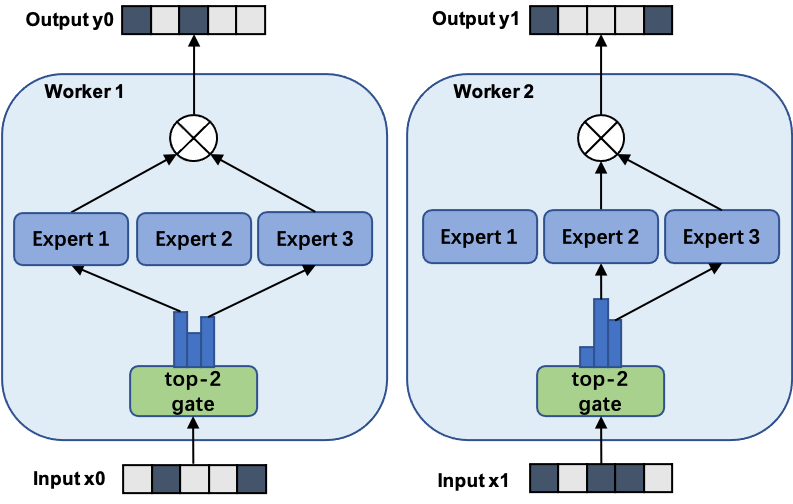
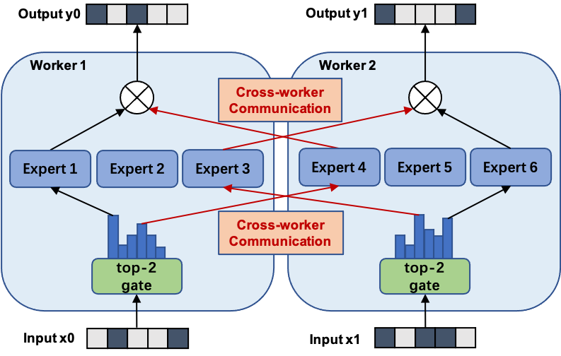

FastMoE 系统
===

[版本更新记录](release-note.md)
| [Slack 讨论组邀请链接](https://join.slack.com/t/fastmoe/shared_invite/zt-mz0ai6ol-ggov75D62YsgHfzShw8KYw)

## 简介

FastMoE 是一个易用且高效的基于 PyTorch 的 MoE 模型训练系统.

## 安装

### 依赖

启用了 CUDA 的 PyTorch 是必要的. 当前版本的 FastMoE 在 PyTorch v1.8.0 和 CUDA 10
的平台上经过了测试. 本系统从设计上也支持更旧的 PyTorch 版本.

如果需要使能 FastMoE 模型并行特性, 那么支持点对点通信的 NCCL 库 (即不旧于
`2.7.5` 版本) 也是必需的.

### 安装

FastMoE 包含一些定制的 PyTorch 算子, 包含一些 C 的组件. 用 `python setup.py install`
来简单地安装 FastMoE.

FastMoE 分布式模型并行特性默认是不被启用的. 如果它需要被启用,
则需要在运行上述命令时加入环境变量 `USE_NCCL=1`.

注意, 由于 PyTorch 框架通常仅集成了 NCCL 的运行时组件, 额外的 NCCL
开发包需要被安装在编译环境中, 而且它的版本需要与 PyTorch 的版本相对应. 推荐使用
[PyTorch 官方 Docker 镜像](https://hub.docker.com/r/pytorch/pytorch),
因为那里的环境较为干净. 如果您希望手工配置环境, 可以在 [NCCL
全部版本的下载链接](https://developer.nvidia.com/nccl/nccl-legacy-downloads)
下载合适版本的 NCCL 开发包.

## 使用

### 将一个 Transformer 模型 FMoE 化

Transformer 是当前最流行的可被 MoE 化的模型. FastMoE 可以一键将一个普通的
Transformer 模型变为一个  MoE 的模型. 其使用方法如下.

例如在 [Megatron-LM](https://github.com/nvidia/megatron-lm) 中,
添加如下的代码即可将 Transformer 中的每个 MLP 层变为多个 MLP 层构成的 MoE 网络.

```python
model = ...

from fmoe.megatron import fmoefy
model = fmoefy(model, num_experts=<number of experts per worker>)

train(model, ...)
```

一个更详细的在 Megatron-LM 中使用 `fmoefy` 函数的样例参见[此处](../examples/megatron).

### 将 FastMoE 作为一个网络模块使用

一个使用 FastMoE 的 Transformer 模型见[这个示例](../examples/transformer-xl).
最简单的使用方式是使用 `FMoE` 层来代替 `MLP` 层. 

### 分布式地使用 FastMoE

FastMoE 支持数据并行和模型并行.

#### 数据并行.

在 FastMoE 的数据并行模式下,
门网络(gate)和专家网络都被复制地放置在各个运算单元上.
下图展示了一个有三个专家的两路数据并行MoE模型进行前向计算的方式.

<p align="center">

</p>

对于数据并行, 额外的代码是不需要的. FastMoE 与 PyTorch 的 `DataParallel` 和
`DistributedDataParallel` 模块都可以无缝对接. 该方式唯一的问题是,
专家的数量受到单个计算单元(如GPU)的内存大小限制.

#### 模型并行

在 FastMoE 的模型并行模式中, 门网络依然是复制地被放置在每个计算单元上的,
但是专家网络被独立地分别放置在各个计算单元上. 因此, 通过引入额外的通信操作,
FastMoE 可以允许更多的专家网络们同时被训练,
而其数量限制与计算单元的数量是正相关的.

下图展示了一个有六个专家网络的模型被两路模型并行地训练.
注意专家1-3被放置在第一个计算单元上, 而专家4-6被放置在第二个计算单元上.

<p align="center">

</p>

FastMoE 的模型并行模式需要专门的并行策略, 而 PyTorch 和 Megatron-LM
都不支持这样的策略. 因此, 需要使用 `fmoe.DistributedGroupedDataParallel`
模块来代替 PyTorch 的 DDP 模块.

## 答疑 / 讨论

如果您在使用 FastMoE 的过程中有任何疑问, 或您有兴趣参与 FastMoE 的相关工作,
欢迎加入我们的 [Slack 讨论组](https://join.slack.com/t/fastmoe/shared_invite/zt-mz0ai6ol-ggov75D62YsgHfzShw8KYw).
